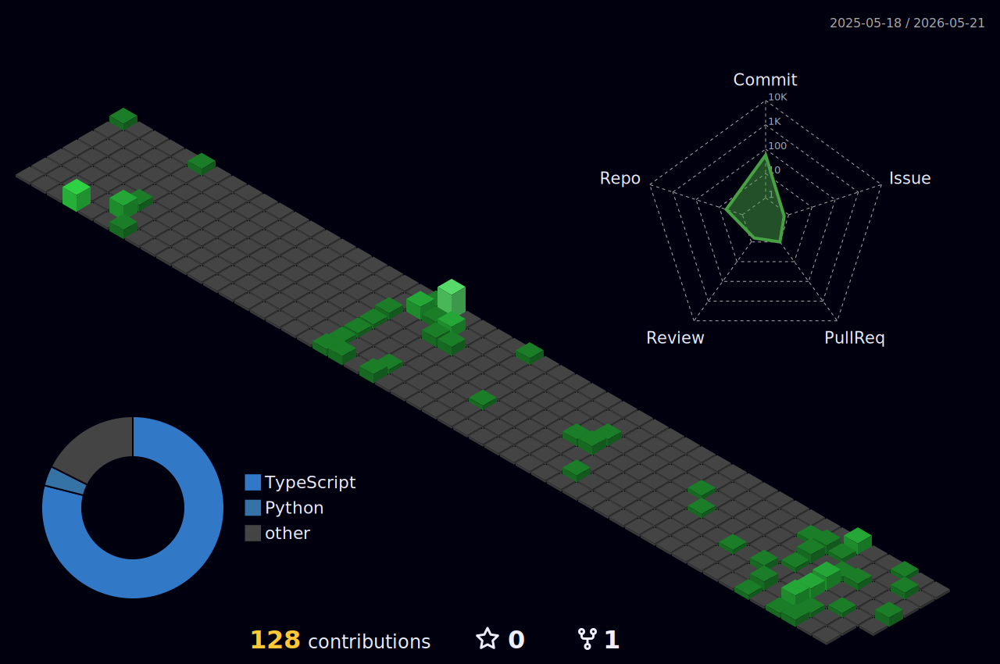

<div align="center">


<br/>

[](https://www.linkedin.com/in/murad-siddiqui/)
[](https://www.muradsiddiqui.me/)
[](https://github.com/MuradSiddiqui)
[](https://github.com/MuradSiddiqui)

</div>

<br/>

<table>
<tr>
<td width="60%" valign="top">

### About Me

```javascript
const Murad_Siddiqui = {
  nationality: "Pakistani", 
  role: "Software Engineer", 
  code: ["Javascript", "Typescript", "NextJS", "ReactJS", "NodeJS", "Python"], 
  tools: ["TailwindCSS", "ShadCN", "Neo4j", "SQL", "Supabase", "Snowflake", "Qdrant"],  
  architecture: ["microservices", "event-driven", "design system pattern"],
  portfolio: "https://www.muradsiddiqui.me/"
}
```

</td>
<td width="40%" valign="top" align="center">


</td>
</tr>
</table>

<br/>

### Tech Stack

**Languages & Frameworks**


**Tools & Platforms**


<br/>

<div align="center">

### GitHub Activity


<br/><br/>



</div>
