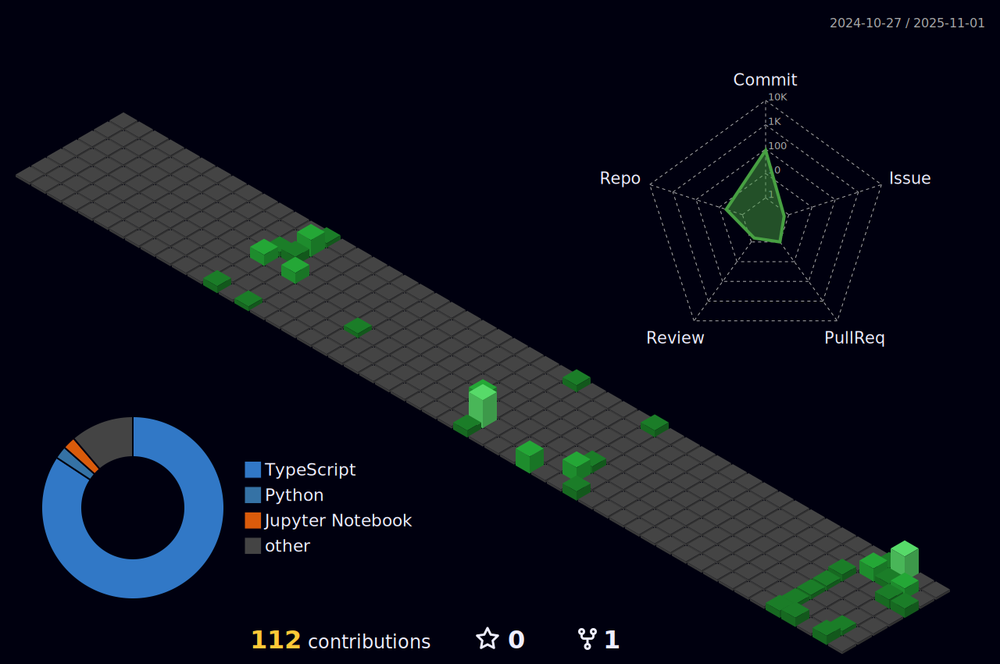

<h2> Hi, I'm Murad Siddiqui! </h2>


### Full-stack Web Developer 

[](https://www.linkedin.com/in/murad-siddiqui/)
[](https://github.com/MuradSiddiqui)


### About Me...

```javascript
const murad = {
  nationality : "Pakistani"
  code: [Javascript, Typescript, NextJS, ReactJS, NodeJS],
  tools: [TailwindCSS, ShadCN, Neo4j, SQL, Supabase, Snowflake],
  architecture: ["microservices", "event-driven", "design system pattern"],
  portfolio : "https://www.muradsiddiqui.me/"
}
```

